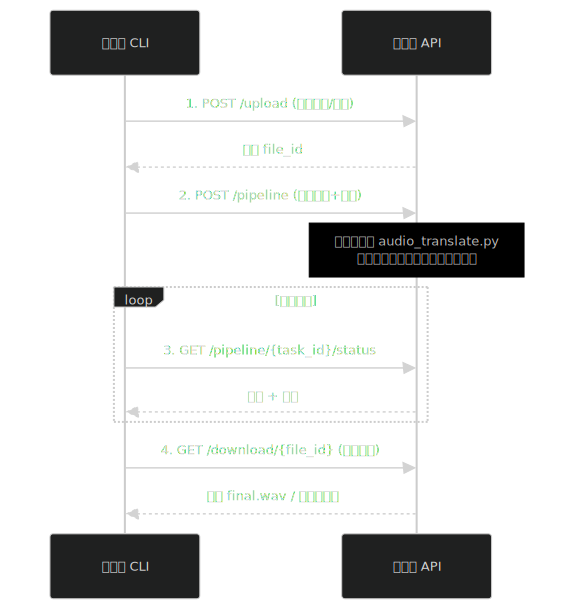

# VideoTrans 客户端

**一行命令，将视频翻译成 80+ 种语言。**

```bash
python video_translate.py 视频1.mp4 视频2.mp4 -t en hi --server <ServerIP>
```

**两个维度的批量处理：**

| 维度 | 说明 | 示例 |
|------|------|------|
| 🎬 多个视频 | 同时指定多个视频文件，服务端批量处理 | `"1.mp4" "2.mp4"` |
| 🌍 多个语种 | 一次生成多种语言版本 | `-t en hi ja` |

> 📌 **输入**支持中文、英语及多种中国方言（[完整列表](#3-支持的语种)）　|　**输出**支持 **80+** 种语言（[完整列表](#3-支持的语种)）

---

## 市场背景

国内短剧市场已超 500 亿但红海内卷，**海外市场正迎爆发前夜**（2026 年 Google 预计达 60 亿美元）。当前美国占据海外半壁江山，但真正的高速增量在新兴市场——**拉美（+69%）、中东（+52%）、印度（+48%）** 增速领跑。幻星之城 AI 翻译精准锚定这三大高潜新兴市场，详见 https://globaldrama.xstar.city/

## 竞品对比

目前业内有三类解决方案：

| 方案 | 代表产品 | 痛点 |
|------|----------|------|
| 人工配音 | 传统配音工作室 | 2025 年中国上线 3.3 万部微短剧，仅将 600 部精品翻译 100 种语言，总成本高达 **2.6 亿元** |
| AI 配音 + 人工剪辑 | 科大讯飞 SoundView | 依赖人工剪辑师对齐音频和音色，成本仅降低一半左右 |
| AI 全自动 | HeyGen、火山引擎 | 无法翻译重叠说话；短时音色容易搞错说话人；未能分离歌声导致配音奇怪 |

### xStar 的核心优势

**1. 成本优势 —— 竞品的 1/10**

单部短剧翻译成本仅为全自动竞品的 **1/10** 左右。核心原因是极致的模型压缩：超过 200G 的十几个模型，压缩到一个可扩展的服务端节点上；单个节点只需 **24G 显存**的 4090 或 3090 即可运行。

**2. 效果优势 —— 行业唯一**

xStar 是目前市面上**唯一**能同时解决以下难题的方案：

- **重叠说话翻译**：多人同时说话翻译成其他语言，对齐各自音频和音色
- **短声纹识别（< 2s）**：声学特征在极短时间内提取的嵌入向量不够稳健是行业难题，xStar 通过专属多模态模型精准定位说话人身份，避免配音人错误
- **歌唱（非音乐）重叠对话翻译**：背景音乐和人声的分离相对容易，但**唱歌的人声与正常说话重叠**时难度较大——歌声和语音同属人声频段，传统分离模型无法区分"有人在说话"和"有人在唱歌"，导致歌声被误当作对话送入 ASR，产生乱码翻译并错误配音。

---

## 快速开始

### 1. 翻译视频

```bash
# 单个视频 → 英语
python video_translate.py "1.mp4" -t en --server <ServerIP>

# 多个视频 + 多个语种
python video_translate.py "1.mp4" "2.mp4" -t en hi ja --server <ServerIP>
```

### 2. 翻译音频

```bash
python audio_translate.py "1.mp3" -t en --server <ServerIP>
```

### 3. 批量短剧翻译

```bash
python short_drama_translate.py "E:\短剧\《逐玉》" -t en --server <ServerIP>
```

脚本自动：整理视频到标准目录 → 转换非 mp4 格式 → 跳过已翻译视频 → 按语种分组批量处理。

---

## 示例效果

以 `示例项目/逐玉` 为例，执行翻译命令后，每个视频旁边会生成翻译结果和中间文件：

```
逐玉/
├── 1.mp4                       ← 原始视频
├── 1.mp3                       ← 提取的音频
├── 1_vocals_denoised.mp3       ← 分离出的人声（经降噪）
├── 1_others_denoised.mp3       ← 分离出的背景音（经降噪）
├── non_speech_vocal_events/     ← 检测到的非语言人声事件（笑声、唱歌等，可试听）
│   ├── 0001_laughter_00000000_00005000.mp3   事件切片音频
│   └── ...
├── 1_translated_en.mp4         ← 英文翻译视频
└── segments/                   ← 所有中间文件
    ├── ASR/                    ← 语音识别结果（逐段 txt：第一行=ASR文本，第二行=音频时长秒数）
    └── English/                ← 英文翻译中间文件
        ├── 0.000.txt          ← 逐段翻译文本
        ├── 0.000.mp3          ← 逐段合成音频
        ├── 0.000/             ← 该片段的候选音频，可人工试听替换
        │   ├── 1.mp3
        │   ├── 2.mp3
        │   └── candidates.md  ← 候选文本、音色相似度、时长信息
        ├── combined.mp3       ← 合并后的完整人声
        └── final.mp3          ← 最终输出音轨
```

`segments/` 目录下包含 ASR 识别文本、逐段翻译文本、合成音频和可下载候选音频等丰富的中间文件，可用于校对和二次编辑。完整结构说明见 [输出文件结构说明.md](输出文件结构说明.md)。

服务端目前利用 **Seed-TTS-eval**（ByteDance 官方基准）和 **MiniMax-Multilingual-Test**（MiniMax 多语言测试集）进行音色评估，并自动选择音色相似度更优的候选。所有合格候选音频也会开放给客户端下载，人工听感更好的候选可以手动替换正式片段音频；当前自动选优主要依据音色相似度，尚未对候选文本正确性做 ASR 校验，后续可增加 ASR 校验进一步筛选。

---


## 架构设计



VideoTrans 采用 **客户端-服务端** 分离架构：

- **客户端**：纯命令行脚本，只负责发送请求和本地 ffmpeg 操作，零业务逻辑
- **服务端**：承载全部 AI 推理（ASR、翻译、TTS、人声分离等），部署在 GPU 机器上

一个客户端可以通过 `--server` 参数指定不同的服务端地址，理论上**支持无上限的横向扩展**——多台 GPU 机器各运行一个服务端，客户端按需分发任务即可。

> ⚠️ 由于 GPU 资源有限，**一个服务端同时只能运行一个客户端提交的任务**，不支持并行。如果需要同时处理多个任务，请部署多个服务端节点，分别用不同的 `--server` 地址提交。

### 服务端监控面板

服务端启动后，浏览器访问 `http://<ServerIP>:8000/` 即可打开任务监控面板，查看当前正在运行的任务、历史任务状态等。

### 服务端 API 文档

服务端基于 FastAPI 构建，访问 `http://<ServerIP>:8000/docs` 可查看完整的 REST API 文档（Swagger UI），包括任务提交、取消、文件上传/下载等接口。

### 成本优势

单部短剧的翻译成本约为竞品的 **十分之一**，核心原因是极致的模型压缩：

- 超过 200G 的十几个模型，压缩到一个可扩展的服务端节点上
- 单个节点只需 **24G 显存**的 4090 或 3090 即可运行
- 硬件成本低，翻译成本自然低

### 批量调度与断点续跑

极致压缩带来了复杂的模型调度需求。模型加载/卸载耗时可观，为了减少频繁切换，服务端会尽量把**所有视频、所有语言**的相同阶段（如同一种 ASR 模型、同一种 TTS 模型）集中处理完毕，再切换到下一个模型。这正是前面提到的"两个批量维度"（多视频 × 多语言）的设计初衷。

这种调度策略意味着任务运行顺序可能与用户直觉不同，中途退出后无法简单从断点顺序接续，因此**断点续跑**功能尤为关键——详见 [批量翻译断点续跑说明.md](批量翻译断点续跑说明.md)。

---

## 输入要求

### 1. 每个视频一个独立文件夹

确保翻译中间文件不会互相覆盖：

```
✅ 正确：
短剧/逐玉/
├── 1/  └── 1.mp4
├── 2/  └── 2.mp4

❌ 错误：
短剧/
├── 逐玉_1.mp4   ← 不同视频混在同一目录
├── 逐玉_2.mp4
```

> 💡 使用 `short_drama_translate.py` 时会自动整理，无需手动操作。也可运行 `Tools/organize_videos_into_folders.py` 单独整理。

### 2. 同名 SRT 字幕文件（可选但建议）

在视频旁放同名 SRT 文件，可提高翻译准确性。没有则系统自动生成。

```
1/
├── 1.mp4    ← 视频
└── 1.srt    ← 同名字幕（可选）
```

> 💡 可运行 `Tools/copy_matching_srt_to_video_folders.py` 批量复制 SRT 到对应视频目录。

> 💡 VideoTrans 会综合 ASR 和 SRT 两种来源进行交叉校准，比单一来源更准确。详见 [字幕ASR综合校准说明.md](字幕ASR综合校准说明.md)。

### 3. 支持的语种

**输入语种（源语言）**：中文、英语及多种中国方言

| 代码 | 语言 | | 代码 | 语言 |
|------|------|-|------|------|
| `zh` | 中文 | | `en` | English |
| `cantonese` | 粤语 | | `minnan` | 闽南语 |
| `sichuan` | 四川话 | | `shanghai` | 上海话 |
| `dongbei` | 东北话 | | `wu` | 吴语 |
| `henan` | 河南话 | | `shaanxi` | 陕西话 |

> 完整列表见 [asr_languages.py](https://github.com/xstar-city/VideoTrans-Common/blob/main/src/Common/asr_languages.py)

**输出语种（目标语言）**：支持 80+ 种语言

| 代码 | 语言 | | 代码 | 语言 |
|------|------|-|------|------|
| `en` | English | | `hi` | Hindi |
| `ja` | Japanese | | `ko` | Korean |
| `es` | Spanish | | `fr` | French |
| `de` | German | | `ar` | Arabic |
| `pt` | Portuguese | | `ru` | Russian |
| `it` | Italian | | `th` | Thai |
| `vi` | Vietnamese | | `id` | Indonesian |

> 完整列表见 [tts_languages.py](https://github.com/xstar-city/VideoTrans-Common/blob/main/src/Common/tts_languages.py)

---

## 翻译命令详解

### 视频翻译

提供两种模式：**基本模式**（快速）和**高级模式**（精确）。

#### 基本模式 `video_translate_basic.py`

适合单人讲座、教学视频、播客等单人主讲场景，预置精简参数，命令更简洁：

```bash
python video_translate_basic.py "1.mp4" -t en --server <ServerIP>
```

预置设置：
- ASR 模式：basic（ASR 自带说话人切分）
- 翻译模式：independent（纯文本翻译）
- 音频变速：禁用（保持原速）

#### 高级模式 `video_translate.py`

支持精细控制，默认启用 TTS 时长感知翻译和精确说话人切分：

```bash
# 默认高级参数
python video_translate.py "1.mp4" -t en --server <ServerIP>

```

**常用高级参数：**

| 参数 | 说明 | 默认值 |
|------|------|--------|
| `--separate` / `--no-separate` | 是否启用人声分离（去背景音）。默认开启；传 `--no-separate` 关闭。 | 启用 |
| `--detect-nonverbal-and-singing` / `--no-detect-nonverbal-and-singing` | 检测「非语言人声」（笑/咳/喷嚏/掌声/叹息）与「唱歌」段，自动从 vocals 分流到背景音轨道。这些虽是人声但无法翻译，留在 vocals 中会污染下游 ASR。默认开启；传 `--no-detect-nonverbal-and-singing` 关闭。 | 启用 |
| `--denoise` | 降噪级别：`none` / `normal` / `aggressive` | `aggressive` |
| `--asr-mode` | ASR 模式：`basic` / `precise`。`precise` 会执行二次说话人切分，生成校准日志（详见[二次说话人切分校准日志说明](二次说话人切分校准日志说明.md)） | `precise` |
| `--enable-visual-diarization` / `--no-enable-visual-diarization` | 是否启用视觉辅助说话人切分（视觉 diarization）。默认关闭，关闭时本地抽 mp3 上传服务端（带宽友好）；开启时直接上传完整 mp4，由服务端结合人脸跟踪/嘴部运动等视觉信号辅助说话人切分。 | 关闭 |
| `--translation-mode` | 翻译模式：`independent` / `tts_aware`（详见下方说明） | `tts_aware` |
| `--translation-models` | 翻译模型（逗号分隔）。各模型翻译质量对比见 [大语言模型翻译测评报告](resourses/2026年最新大语言模型翻译测评报告：中文_英语到印地语.md) | 自动选择 |
| `--extra-translation-guideline` | 额外翻译指南文件路径 | 无 |
| `--tts-aware-max-retries` | TTS 时长调整重试次数 | 3 |
| `--tts-max-audio-slowdown-pct` | TTS 合成音频最大减速百分比（合成短于参考时 librosa 拉伸放慢的上限） | 0.2 |
| `--tts-max-audio-speedup-pct` | TTS 合成音频最大加速百分比（合成长于参考时 librosa 拉伸加快的上限） | 0.2 |
| `--tts-aware-min-candidate-count` | 每个片段至少保留的合格候选音频数量（1-10，服务端自动限制范围） | 3 |

#### 翻译模型列表（`--translation-models`）

客户端是开源的，默认使用的模型列表在 `video_translate.py` 的 `DEFAULT_MODELS` 变量中定义：

```python
# 对外客户端/video_translate.py
DEFAULT_MODELS = ['gemini-3.5-flash', 'gemini-3.5-flash', 'gemini-3.1-flash-lite', 'deepseek-v4-pro', 'doubao-seed-2-0-pro']
```

翻译时会**按顺序依次尝试**列表中的模型，因此：

- **模型可以重复**：例如上例中 `gemini-3.5-flash` 出现两次，表示首次失败后自动重试一次。
- **顺序兜底保证鲁棒性**：如果某个模型服务出错或不可访问，会自动跳到列表中的下一个模型继续翻译，不会因为单个模型故障导致整个流程中断。
- **自定义方式**：既可以在命令行通过 `--translation-models modelA,modelB` 临时指定，也可以直接修改 `DEFAULT_MODELS` 变量调整默认值。

各模型的翻译质量对比见 [大语言模型翻译测评报告](resourses/2026年最新大语言模型翻译测评报告：中文_英语到印地语.md)。

#### 翻译模式与时长匹配（`--translation-mode`）

不同语言语速差异大，翻译后语音时长往往与原文不一致。为了保证视频画面不被拉伸、背景音轨不漂移，本系统要求**每段 TTS 合成音频的时长严格等于原段时长**，时长贴合的责任全部收敛到 TTS 段自身，依次有三层兜底：

| 层 | 手段 | 何时触发 |
|---|------|---------|
| 第 1 层 | LLM 调整翻译措辞 | 仅 `tts_aware` 模式：试合成 → 测时长 → 超范围则让 LLM 改写措辞重译，默认重试 3 次 |
| 第 2 层 | 模型重合成（仅支持 `duration` 参数的 TTS） | 第 1 层无法消化时，用带 duration 参数喂回模型直接生成等长音频 |
| 第 3 层 | librosa 信号级时长拉伸 | 兜底：严格把音频拉到目标时长，所有 TTS 通用 |

第 3 层永远兜底执行，**落盘时强制等长**，不留误差。

`--translation-mode` 控制是否启用第 1 层：

- **`independent`**（独立翻译）：只做文本翻译，不调整措辞控制时长。翻译速度快，所有时长差异完全由第 3 层 librosa 拉伸消化，长差异大的句子语速变化会比较明显。
- **`tts_aware`**（TTS 时长感知翻译，默认）：试合成 + 时长反馈循环，大部分差异在第 1 层就被消化，语音自然度更高。`--tts-aware-max-retries` 控制每段的 LLM 重译次数（默认 3）。

> 💡 视频画面和背景音轨不再做任何拉伸，因此音频段必须严格等长，没有"允许误差"的概念。如对 LLM 重译次数有特殊要求可调 `--tts-aware-max-retries`。

**TTS 时长感知翻译的调优参数：**

| 参数 | 说明 | 默认值 |
|------|------|--------|
| `--tts-max-audio-slowdown-pct` | 合成音频**短于**参考音频时，第 3 层 librosa 兜底拉伸最多放慢此比例。值越大允许的减速越多，但语速过慢会不自然 | 0.2（即最多放慢 20%） |
| `--tts-max-audio-speedup-pct` | 合成音频**长于**参考音频时，第 3 层 librosa 兜底拉伸最多加快此比例。值越大允许的加速越多，但语速过快会不自然 | 0.2（即最多加快 20%） |
| `--tts-aware-min-candidate-count` | 每个片段至少保留的合格候选音频数量。值越大候选越多、选优质量越高，但 TTS 合成次数也越多、耗时越长。服务端自动限制在 1-10 范围 | 3 |

> 💡 这三个参数仅 `tts_aware` 模式下生效。`independent` 模式下时长差异完全由第 3 层 librosa 拉伸消化，前两个参数控制拉伸上限。

### 音频翻译 `audio_translate.py`

仅翻译音频文件，不涉及视频处理：

```bash
python audio_translate.py "1.mp3" -t en --server <ServerIP>
python audio_translate.py "1.mp3" "2.mp3" -t en hi --server <ServerIP>
```

### 批量短剧翻译 `short_drama_translate.py`

翻译整部短剧（含多个视频片段）：

```bash
python short_drama_translate.py "E:\短剧\《逐玉》" -t en --server <ServerIP>
```

批量翻译任务可能运行数小时，中途退出后重新执行同样命令即可续跑——已完成的步骤会自动跳过。详见 [批量翻译断点续跑说明.md](批量翻译断点续跑说明.md)。

---

## 客户端编辑重跑模式

翻译完成后，如果对 ASR 文本或翻译结果不满意，可以在本地编辑后**只重跑受影响的部分**，无需重新执行耗时的 ASR 流程。

### 用法

```bash
# 视频翻译
python video_translate.py "1.mp4" -t en --server <ServerIP> --edit-rerun

# 音频翻译
python audio_translate.py "1.mp3" -t en hi --server <ServerIP> --edit-rerun
```

### 前置条件

- 服务端已有该任务的运行记录（`.vt_task_id` 对应的任务存在且已完成 ASR 阶段）
- 客户端本地已通过正常翻译下载过 `segments/` 目录结构

### 编辑场景

启动后，客户端会逐一对比本地与服务端的文件内容/存在性，检测到以下编辑后自动处理：

**术语说明：**

| 简称 | 完整路径 | 说明 |
|------|----------|------|
| ASR 文本 | `segments/ASR/{stem}.txt` | 原声音频的语音识别结果。格式：第一行=ASR 文本，第二行=音频时长秒数（三位小数） |
| 翻译文本 | `segments/{lang}/{stem}.txt` | ASR 文本翻译到目标语言后的文本 |
| 合成音频 mp3 | `segments/{lang}/{stem}.mp3` | 基于翻译文本 TTS 合成的目标语言音频 |
| 翻译候选 md | `segments/{lang}/{stem}.md` | 翻译过程中保存的候选/调试信息 |

| 场景 | 操作方式 | 客户端检测 | 自动执行 |
|------|----------|-----------|---------|
| **改 ASR 文本** | 编辑 `segments/ASR/{stem}.txt` | 下载服务端 ASR 文本逐字对比，内容不一致 | 上传新 ASR 文本；删除所有语言目录下同 stem 的 翻译文本 + 合成音频 mp3 + 翻译候选 md + 候选目录 |
| | | | 若时长行（第二行）也变更：额外删除 `segments/{stem}.mp3` + 各语言目录下 `{stem}.mp3` + md + 候选目录，服务端重新切分 |
| **新增 ASR 文本** | 在 `segments/ASR/` 下新建 `{stem}.txt` | 客户端有但服务端没有 | 校验两行格式 + 时长 > 0.3s → 上传 txt；服务端自动从人声音频切分 mp3 |
| **改翻译文本** | 编辑 `segments/{lang}/{stem}.txt` | 下载服务端翻译文本逐字对比，内容不一致 | 上传新翻译文本；删除该语言目录下同 stem 的 合成音频 mp3 + 翻译候选 md + 候选目录 |
| **替换合成音频** | 用候选/外部音频替换 `segments/{lang}/{stem}.mp3` | 对比本地与服务端文件大小，大小不一致则判定修改（大小相同则比 MD5 哈希） | 上传新 MP3；删除 combined.mp3 + final.mp3 触发重新合成 |
| **删语种** | 删除本地语言目录（如 `English/`） | 本地目录不存在 | 删除服务端对应语言目录 |
| **删某句合成音频** | 删除 `segments/{lang}/{stem}.mp3` | 本地合成音频 mp3 缺失 | 删除服务端对应 合成音频 mp3 + 翻译候选 md + 候选目录 |
| **删某句翻译文本** | 删除 `segments/{lang}/{stem}.txt` | 本地翻译文本缺失 | 删除服务端对应 翻译文本 + 合成音频 mp3 + 翻译候选 md + 候选目录 |

处理完成后，服务端跳过整个 ASR 流程（人声分离、语音识别、残差合并），**直接从翻译步骤开始**，仅重跑受影响的部分。

新增/修改 ASR 文本时，服务端会在翻译前执行「音频修复」步骤：扫描 ASR txt 对应的 mp3，缺失则从人声音频切分（含响度兜底），并更新 `final-asr-result.json`。时长变更的检测和旧 mp3 删除由客户端负责（对比本地与服务端 txt 的第二行时长，服务端旧 txt 可能没有第二行，此时只要客户端有时长行就视为变更）。

#### 手动拆句示例

针对视觉+声纹都无法切开的句子（极少数情况：声纹很接近、两人说话连成一片、中间无人脸切换），可以手动拆分：

假设原句 `62.300.txt` 文本 "ABCD"，时长 5.000s：

1. 修改 `62.300.txt`：第一行改为 "AB"，第二行改为 `2.500`
2. 新建 `64.800.txt`：第一行 "CD"，第二行 `2.500`
3. 运行 `--edit-rerun`

客户端自动上传修改和新增的 txt，删除旧 mp3；服务端自动切分两段新 mp3，更新 JSON，然后翻译受影响段落。

### 自动删除已翻译视频

编辑重跑模式下，会自动删除本地已翻译的目标语言视频（如 `1_translated_en.mp4`），否则已存在的视频会触发跳过检查导致任务不被执行。仅删除本次命令 `-t` 指定的目标语言视频，未指定的语言不受影响。

### 时间同步检查

启动时会自动检查客户端与服务端系统时间差异：
- 差异 > 5 秒：打印警告
- 差异 > 60 秒：打印强烈警告，建议同步系统时间

> 时间差异仅影响断点续跑的缓存判断，不影响编辑重跑的正确性（编辑检测基于文本内容对比，不依赖时间）。

### 示例工作流

```
# 1. 首次翻译
python video_translate.py "1.mp4" -t en --server 192.168.1.100

# 2. 翻译完成后，编辑本地 ASR 文本
#    编辑 1/segments/ASR/0.000.txt 修正识别错误

# 3. 编辑重跑——只重新翻译受影响的段落
python video_translate.py "1.mp4" -t en --server 192.168.1.100 --edit-rerun
```

> 💡 编辑重跑模式与断点续跑兼容。如果编辑重跑过程中途中断，再次执行同样的 `--edit-rerun` 命令即可续跑。

---

## 依赖安装

### 1. Python 环境

```bash
pip install requests
```

### 2. FFmpeg

FFmpeg 是必需的外部工具，需在 PATH 中可用：

```bash
# 验证安装
ffmpeg -version
ffprobe -version
```

### 3. Common 模块

```bash
git clone --recurse-submodules https://github.com/xstar-city/VideoTrans-Client.git
cd VideoTrans-Client
cd Common && pip install -e . && cd ..
```

详见 [Common/README.md](https://github.com/xstar-city/VideoTrans-Common/blob/main/README.md)

---

## 常见问题

**Q: 翻译中断了怎么办？**  
A: 重新运行同样的命令即可续跑。已完成的步骤（ASR、翻译、TTS 等）会自动跳过。详见 [批量翻译断点续跑说明.md](批量翻译断点续跑说明.md)。

**Q: 如何强制从零开始？**  
A: 删除视频目录下的 `.vt_task_id` 文件，或运行时加 `--new-task` 参数。

**Q: 视频不在独立目录怎么办？**  
A: 运行 `Tools/organize_videos_into_folders.py` 自动整理，或使用 `short_drama_translate.py` 会自动整理。

**Q: 支持哪些视频格式？**  
A: mp4、mov、mkv、avi、webm、m4v。非 mp4 格式会自动转换。

**Q: 服务端连接不上？**  
A: 检查 `--server` 参数是否正确，确认服务端已启动且端口可达。
