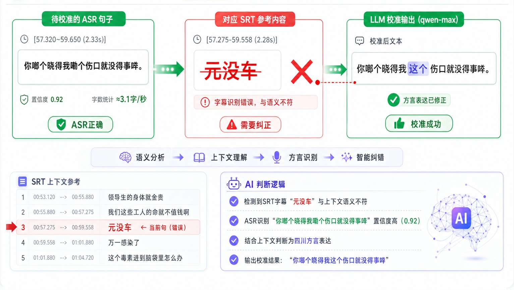

# 字幕 ASR 综合校准说明

## 为什么需要校准

市面上大多数视频翻译产品只依赖单一文本来源——要么 ASR（语音识别），要么 SRT（字幕文件），要么 OCR（画面文字识别）。单一来源各有缺陷：

- **ASR**：方言、口音、背景音乐干扰，识别结果常有错误
- **SRT**：字幕本身也可能有错别字、遗漏、时间轴偏移
- **OCR**：分辨率低、字幕特效干扰，识别率不稳定

VideoTrans 采用 **ASR + SRT 综合校准**策略——同时参考两种来源，交叉验证，取长补短，生成比任一单一来源都更准确的文本。

上图中，ASR 将"女娃子"误识别为"女孩子"，而 SRT 正确；同时 SRT 将"排着队想嫁给你"拆成了两段且有遗漏，ASR 却完整识别。综合校准能从两个来源中各取正确部分，产出最优结果。

---

## 校准的核心难点：多对多对齐

ASR 和 SRT 的句子并非一一对应，而是**多对多**的关系：

- 一句 SRT 可能对应多句 ASR（SRT 是长句，ASR 切分更细）
- 一句 ASR 可能对应多句 SRT（ASR 合并了短句）
- 某些句子只有 ASR 有、SRT 没有，或反之

更复杂的是，当视频中存在**背景旁白**（如片头曲、片尾曲、画外音）时，字幕往往无法与 ASR 对应。下面是一个真实案例：

### 案例：背景歌曲与对白交织

**待校准的 ASR 句子组**（5 句 ASR 共享同一段 SRT，需分别校准并拆分）

参考语速约 2.3 字/秒

| 时间段 | ASR 文本 | 置信度 | 估算字数 |
|--------|----------|--------|----------|
| 154.466~157.640 (3.17s) | 你晓不晓得好多的女孩子排着队想。 | 0.92 | ≈7字 |
| 157.870~158.440 (0.57s) | 嫁给你。 | 0.99 | ≈1字 |
| 159.160~160.450 (1.29s) | 原来离婚了的说。 | 0.72 | ≈3字 |
| 160.660~163.600 (2.94s) | 梦点燃一盏灯的暖黄， | 0.84 | ≈7字 |
| 163.600~169.050 (5.45s) | 照亮夕阳胜过我四方。 | 0.84 | ≈12字 |

**对应 SRT 参考内容**

| 时间段 | SRT 文本 |
|--------|----------|
| 154.358~155.075 (0.72s) | 你晓不晓得 |
| 155.208~157.008 (1.80s) | 好多的女娃子排着队 |
| 157.125~158.558 (1.43s) | 想嫁给你 |
| 159.158~160.842 (1.68s) | 原来离婚了 |
| 163.842~168.758 (4.92s) | 小城故事多 |
| 168.875~172.842 (3.97s) | 充满喜和乐 |

**分析：**

1. **ASR 有误**："女孩子"应为"女娃子"（SRT 正确），"离婚了的说"多了"的说"（SRT 正确为"离婚了"）
2. **SRT 不完整**：SRT 没有覆盖"梦点燃一盏灯的暖黄 / 照亮夕阳胜过我四方"——这是背景歌曲的歌词，SRT 字幕未收录
3. **ASR 误识别背景歌曲**：ASR 把背景歌曲"小城故事多 / 充满喜和乐"误听成"梦点燃一盏灯的暖黄 / 照亮夕阳胜过我四方"，置信度仅 0.84
4. **多对多关系**：前 4 句 ASR 对应前 4 句 SRT（但切分边界不同），后 2 句 ASR 对应后 2 句 SRT（内容完全不同）

综合校准系统需要同时处理对齐、纠错、识别背景旁白等多种情况，才能输出正确的校准结果。

---

## 校准日志

校准过程的详细记录保存在 `segments/ASR/sentence-reconcile-log.md` 中，可用于审查校准决策和排查问题。
